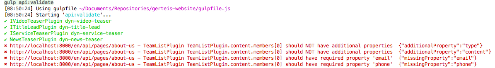
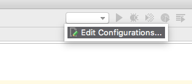
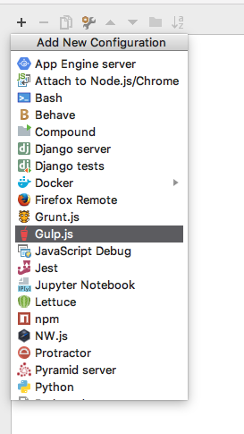
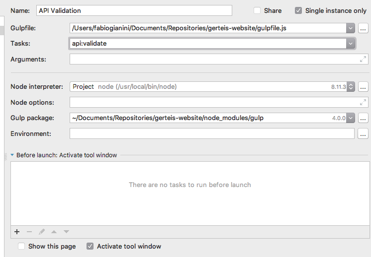

# ts-interface-route-validator

Module to validate API responses against TypeScript interfaces

# Install

    npm i @dreipol/ts-interface-route-validator

# Setup
First create a file to execute the validator.

    const ROUTES = require('./routes.json'); // load the config file
    const { validateRoutes } = require('@dreipol/ts-interface-route-validator'); // include the validator
    const searchPath = `${process.cwd()}/**/*.ts`; // point to the location where your interfaces are stored
    
    validateRoutes(searchPath, ROUTES);
    
    
The code above will print the following in your CLI

    
## Config
There is a simple config file required. In the example above it's the `routes.json` file. In there we 
define a couple of routes/api endpoints we want to validate. In Addition we have to provide a `dataPath`.
This path is required to access the data of the returned response.
The `plugins` object, is a simple key value map. It maps the plugin types to the interface names.

    [
        {
            "urls": [
                "http://localhost:8000/en/api/pages",
                "http://localhost:8000/en/api/pages/about-us"
            ],
            "dataPath": "data.containers.main.plugins",
            "definitions": {
                "dyn-title-lead": "IVideoTeaserPlugin",
                "dyn-video-teaser": "IVideoTeaserPlugin"
            }
        }
    ]

if you want to validate a single object from the response, you can configure it like this

    {
        "urls": [
            "http://localhost:3000/en/api/pages/?partials=footer"
        ],
        "dataPath": "partials.footer",
        "definition":  "FooterInterface"
    }

## Usage
The best and easiest way to add this API validation to setup, is to create a
`gulp` task for tha validation.

    const gulp = require('gulp');
    const { validateRoutes } = require('@dreipol/ts-interface-route-validator'); // include the validator
    
    const { src } = require('../../config/paths.js'); // Project config
    const searchPath = `${src}/**/*.ts`; // point to the location where your interfaces are stored
    
    gulp.task('api:validate', function() {
        const ROUTES = require('../../config/api.json'); // load the api routes config file
        return validateRoutes(searchPath, ROUTES);
    });
    
Now we can either call this command on the CLI by running `gulp api:validate`
or by adding the gulp task to the IDE.
This is done by adding a new `Run/Debug Configuration`. 

There we select `Gulp.js` as a new config base. 

Now the only thing we have to set is the `Name` and the `Gulp Task`. 

The name can be set how ever you want it. The `Gulp Task` has
to be the name of the task above. In this case it's `api:validate`.

